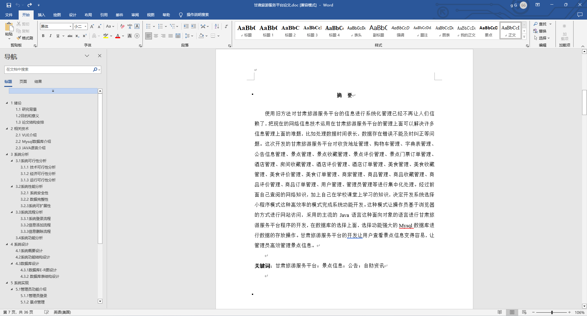

基于Springboot的甘肃旅游服务平台（程序+论文）
=
### 完整代码获取地址：从戎源码网 ([https://armycodes.com/](https://armycodes.com/))
### 作者微信：19941326836  QQ：952045282 
### 承接计算机毕业设计、Java毕业设计、Python毕业设计、深度学习、机器学习
### 选题+开题报告+任务书+程序定制+安装调试+论文+答辩ppt 一条龙服务
### 所有选题地址https://github.com/nature924/allProject

一、项目介绍
---
基于Spring Boot框架实现的甘肃旅游服务平台，系统包含三种角色：管理员、商家、用户,系统分为前台和后台两大模块，主要功能如下。
### 前台：
1. 首页：展示平台的概况、热门景点、推荐酒店等信息。
2. 商家：展示注册在平台上的各类商家信息。
3. 景点：展示甘肃各个景点的介绍、门票价格等信息。
4. 酒店：展示可预订的酒店信息。
5. 美食：介绍甘肃特色美食、推荐餐厅等信息。
6. 商品：展示可购买的甘肃特色商品。
7. 公告信息：发布关于旅游安全、天气变化等相关公告信息。
8. 个人中心：用户可以管理个人信息、查看订单、修改密码等。
9. 购物车：用户可以将感兴趣的商品、景点门票等加入购物车。

### 后台：
### 管理员：
1. 个人中心：管理个人信息，包括修改密码、查看个人资料等。
2. 管理员管理：对其他管理员进行添加、编辑、删除等操作。
3. 基础数据管理：管理系统的基础数据，包括景点分类、酒店信息、美食信息等。
4. 公告信息管理：发布平台的公告通知。
5. 景点管理：管理景点信息，包括添加、编辑、删除景点信息等操作。
6. 酒店管理：管理酒店信息，包括添加、编辑、删除酒店信息等操作。
7. 美食管理：管理美食信息，包括添加、编辑、删除美食信息等操作。
8. 商品管理：管理平台上出售的商品信息，包括添加、编辑、删除商品信息等操作。
9. 商家管理：管理注册在平台上的商家信息，包括审核、管理商家账号等。
10. 用户管理：管理平台的注册用户信息，包括查看、禁用用户账号等操作。
11. 轮播图信息：管理首页轮播图的展示内容，包括添加、编辑、删除轮播图等操作。

### 商家：
1. 个人中心：管理个人信息，包括修改密码、查看个人资料等。
2. 公告信息管理：发布商家相关的公告信息。
3. 景点管理：商家可以管理自己提供的旅游景点信息，包括添加、编辑、删除景点信息等操作。
4. 酒店管理：商家可以管理自己提供的酒店信息，包括添加、编辑、删除酒店信息等操作。
5. 美食管理：商家可以管理自己提供的美食信息，包括添加、编辑、删除美食信息等操作。
6. 商品管理：商家可以管理自己销售的商品信息，包括添加、编辑、删除商品信息等操作。

二、项目技术
---
- 编程语言：Java
- 数据库：MySQL
- 项目管理工具：Maven
- 前端技术：VUE、HTML、Jquery、Bootstrap
- 后端技术：Spring、SpringMVC、MyBatis

三、运行环境
---
- 操作系统：Windows、macOS都可以
- JDK版本：JDK1.8以上都可以
- 开发工具：IDEA、Ecplise、Myecplise都可以
- 数据库: MySQL5.7以上都可以
- Tomcat：任意版本都可以
- Maven：任意版本都可以

四、运行截图
---
### 论文截图：

### 程序截图：

